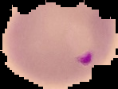
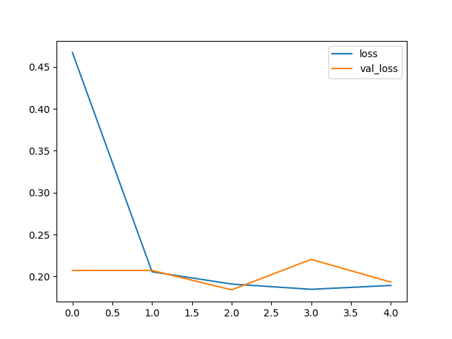
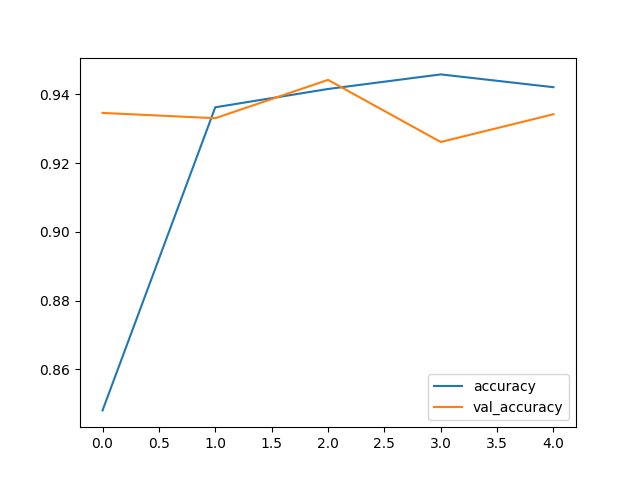

# Malaria Model 🤖

> Convolutional neural network that predicts if an image of a cell is parasitized by malaria or not.

## Goals

Predict if an image of a cell is parasitized by malaria:

### Parasitized



### Uninfected


## Results

### Confusion matrix

```shell
[[1165  135]
 [  45 1255]]
```

### Classification report

```shell
              precision    recall  f1-score   support

           0       0.96      0.90      0.93      1300
           1       0.90      0.97      0.93      1300

    accuracy                           0.93      2600
   macro avg       0.93      0.93      0.93      2600
weighted avg       0.93      0.93      0.93      2600
```

## Exploratory data analysis

### Loss



### Accuracy



## Running

To run the model first create a new Python environment and activate it. I'm using [Anaconda](https://www.anaconda.com/) for setting the python version that pipenv should use to set up the environment. The command bellow will automatically setup the environment with conda and pipenv:

```shell
make env
```

Now install all the project dependencies:

```shell
make install-all
```

And run the model:

```shell
make model
```

> [!WARNING]
> Dont run `make model` without deleting `storage/malaria-model.keras`, this will
> cause train/test data over fitting.

After running you model, it will be saved inside `storage/malaria-model.keras`.
To just run your recent created model and predict a random value from our data set,
use the following script:

```shell
make predict 
```

> [!WARNING]
> In case you have deleted the `storage/malaria-model.keras`, remember that to get `make predict` working you need to run `make model` first to create it.

To run TensorBoard with the latest created version of the model within this
repository run:

```shell
make board
```
